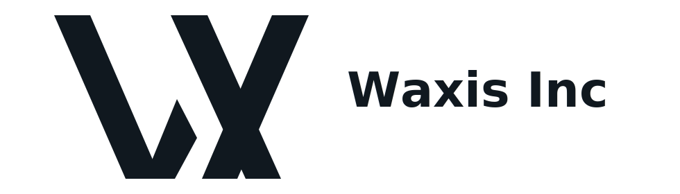

  <a href="https://www.waxis.org">
    <picture>
      <source media="(prefers-color-scheme: dark)" srcset="./waxis-logo-dark.svg">
      <source media="(prefers-color-scheme: light)" srcset="./waxis-logo-light.svg">
      
    </picture>
  </a>

<h3 align="center">Enterprise AI server platform for real business operations.</h3>

Waxis Inc helps B2B companies connect models, workflows, knowledge, data, and agents into deployable, governable AI software systems. We build production platforms that go beyond chatbots and concept demos: AI control planes, workflow automation, business agents, enterprise knowledge systems, customer operations AI, supply chain automation, and AI-ready data analytics.

## Platform Capabilities

- Enterprise AI control planes for model routing, access, logs, policies, cost control, and provider reliability
- Workflow automation for sales, procurement, support, warehouse, finance, approvals, and operations
- Business agents that read materials, call tools, generate files, update systems, and complete multi-step work
- Enterprise knowledge, RAG, citation tracing, access control, and domain AI for proprietary company knowledge
- AI-ready data and analytics with ingestion, semantic metrics, natural-language queries, reports, and anomaly alerts

## Public Product Repositories

- [Waxis AI Control Plane](https://github.com/waxis-inc/waxis-ai-control-plane)  
  Governed AI model gateway, routing, guardrails, observability, approvals, and evaluation control plane.

- [Waxis Sales & Customer Service AI](https://github.com/waxis-inc/waxis-sales-customer-service-ai)  
  AI customer operations layer for sales, support, customer records, handoff, QA, and risk alerts.

- [Waxis Supply Chain & Inventory Automation](https://github.com/waxis-inc/waxis-supply-chain-inventory-automation)  
  AI-assisted inventory health, replenishment, supplier risk, exception management, and supply-chain workflows.

- [Waxis Enterprise Knowledge & Domain AI](https://github.com/waxis-inc/waxis-enterprise-knowledge-domain-ai)  
  Permissioned enterprise knowledge, RAG, citations, GraphRAG-style domain AI, and agent-ready knowledge APIs.

- [Waxis AI-ready Data & Analytics](https://github.com/waxis-inc/waxis-ai-ready-data-analytics)  
  Governed data ingestion, semantic metrics, natural-language analytics, recurring reports, and anomaly alerts.

## How We Deliver

We start with one valuable workflow, then expand it into a maintainable platform.

1. Business diagnosis: goals, human workflow, existing systems, data locations, access boundaries, and launch constraints
2. Architecture design: how the AI server, workflows, agents, knowledge base, and data layer connect
3. MVP launch: one high-value use case with human checkpoints, logs, monitoring, and fallback behavior
4. System expansion: more business lines, data sources, access roles, and automation steps
5. Operating optimization: cost, accuracy, response speed, and adoption improved through real usage data

Precision. Structure. Trust.

## Contact

- Website: [waxis.org](https://www.waxis.org)
- Email: [support@waxis.org](mailto:support@waxis.org)
- Location: Toronto, Canada

## Website

- [waxis.org](https://www.waxis.org)
